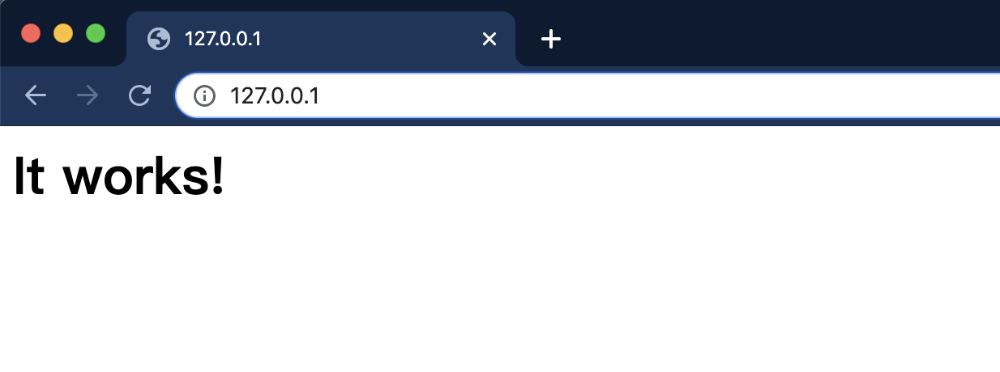
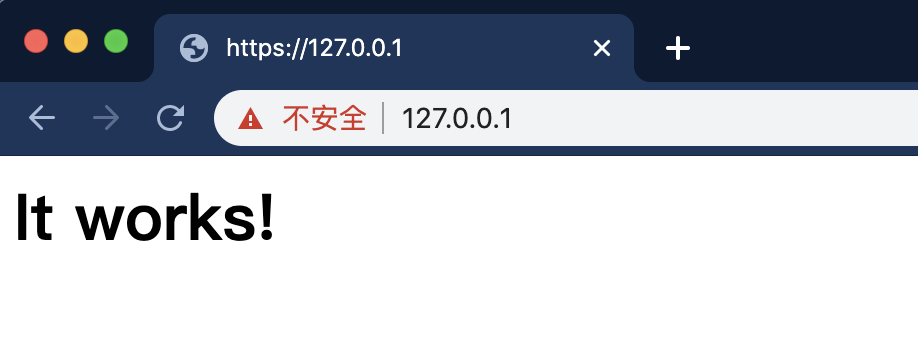
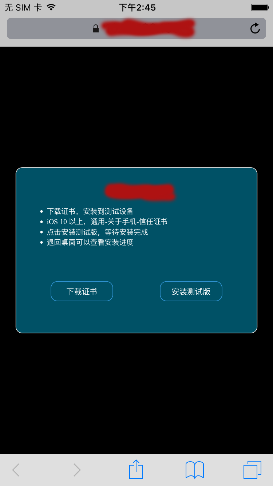
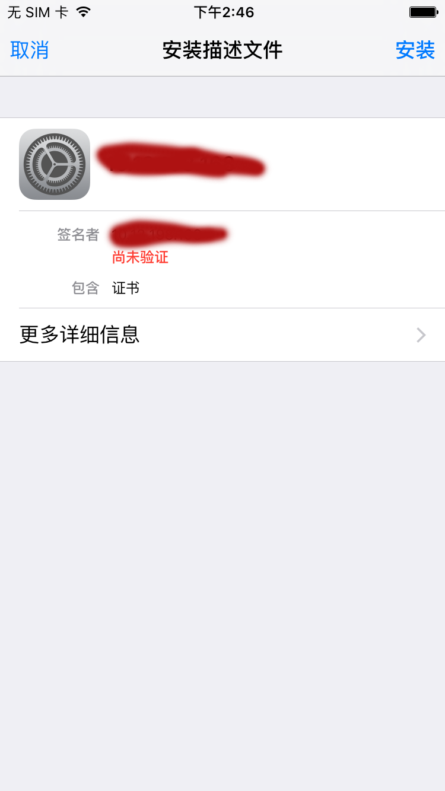
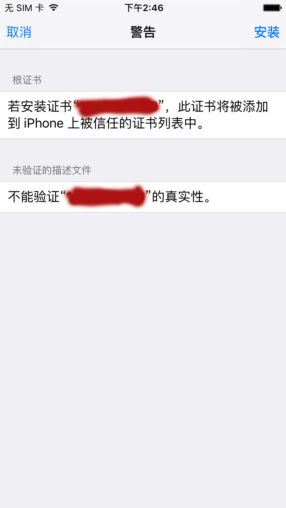

## What is OTA
> Over-the-Air programming (OTA) refers to various methods of distributing new software, configuration settings, and even updating encryption keys to devices like mobile phones, set-top boxes or secure voice communication equipment. ——Wikipedia

&emsp;&emsp;OTA(Over-the-Air)，是通过无线方式分发应用、配置设置、甚至是移动设备加密密钥的一种技术。通过OTA的安装方式，开发者只需在移动设备上访问指定Url即可进行下载安装，不必再依赖数据线。

&emsp;&emsp;苹果为了使开发者能够通过无线方式分发自己的内部iOS应用，推出了itms-services协议来支持iOS应用OTA分发。iOS应用OTA安装方式的核心就是苹果的itms-services协议，Safari浏览器可以通过解析itms-services协议来实现一键安装。在iOS7.1之前plist文件的url地址是没有限制的，之后苹果修改了规则，这个url必须是可信任的https链接，至于其他的例如ipa文件的链接，没有特殊要求。

## OTA's dependencies
- 用于部署的 https web 服务相关

依赖 | 备注
:--: | :--:
Web 服务器 | 本文将会以 Mac OS 系统自带的 Apache 为例讲解
HTTPS 服务 | 根据[苹果官方文档](https://support.apple.com/zh-cn/guide/deployment-reference-ios/welcome/web)，对于iOS 7.1及以系统必须使用HTTPS
SSL证书 | 用于开启HTTPS服务
HTML页面 | HTTPS证书/iOS应用下载页

- iOS应用相关

依赖 | 备注
:--: | :--:
ipa | 个人或企业证书签名的安装包
manifest.plist | ipa对应的清单文件
icon | 应用icon文件，规格可选大(512x512)小(120x120)各一张

## How to setup OTA
### Web服务器部署
Mac自带Apache，用`httpd -v`查看apache的版本号。Apache的文件目录默认在`/Library/WebServer/Documents`,可以通过`/etc/apache2/httpd.conf`配置文件进行修改。
```sh
$ httpd -v
Server version: Apache/2.4.34 (Unix)
Server built:   Feb 22 2019 20:20:11
```
Apache的常用命令：
```sh
# 启动
sudo apachectl start
# 停止
sudo apachectl stop
# 重启
sudo apachectl restart
```
启动Apache后在浏览器中输入http://localhost/ 或者http://127.0.0.1/ ，看到“It Works”页面即开启成功。


### 获得SSL签名证书
这里我们使用自签名的方式，有条件的话可以付费选择苹果认证的签名
* 创建存储证书的路径
```sh
$ cd /private/etc/apache2/
$ sudo mkdir ssl
$ cd ssl
```
* 创建主机秘钥
```sh
$ sudo openssl genrsa -out server.key 2048
Generating RSA private key, 2048 bit long modulus
...............................................................................................................+++
.......................................................+++
e is 65537 (0x10001)
```
* 创建签署申请

```sh
$ sudo openssl req -new -key server.key -out server.csr
# 注意Comon Name处一定要填写完整的域名或者IP地址，其他可以随意填写或留空
You are about to be asked to enter information that will be incorporated
into your certificate request.
What you are about to enter is what is called a Distinguished Name or a DN.
There are quite a few fields but you can leave some blank
For some fields there will be a default value,
If you enter '.', the field will be left blank.
-----
Country Name (2 letter code) []:
State or Province Name (full name) []:
Locality Name (eg, city) []:
Organization Name (eg, company) []:
Organizational Unit Name (eg, section) []:
Common Name (eg, fully qualified host name) []:192.168.1.0
Email Address []:

Please enter the following 'extra' attributes
to be sent with your certificate request
A challenge password []:
```

* 创建SSL证书
```sh
$ sudo openssl x509 -req -days 3650 -in server.csr -signkey server.key -out server.crt
# -days 参数是证书有效期，按需修改
Password:
Signature ok
subject=/CN=192.168.1.0
Getting Private key
```

* 移除秘钥的密码
```sh
$ sudo openssl rsa -in server.key -out server-nopass.key
writing RSA key
```

操作完毕后当前目录（ssl）应该有以下几个文件
```sh
$ ls -l
total 32
-rw-r--r--  1 root  wheel  1675 12 18 11:48 server-nopass.key
-rw-r--r--  1 root  wheel   989 12 18 11:47 server.crt
-rw-r--r--  1 root  wheel   895 12 18 11:42 server.csr
-rw-r--r--  1 root  wheel  1675 12 18 11:41 server.key
```

### 配置HTTPS服务
* 备份要修改的文件
```sh
$ sudo cp /private/etc/apache2/httpd.conf /private/etc/apache2/httpd.conf.bak  
$ sudo cp /private/etc/apache2/extra/httpd-ssl.conf /private/etc/apache2/extra/httpd-ssl.conf.bak  
$ sudo cp /private/etc/apache2/mime.types /private/etc/apache2/mime.types.bak  
```
* 修改配置文件`/private/etc/apache2/httpd.conf` (只读文件,请用管理员权限打开以便修改，如：sudo vim /private/etc/apache2/httpd.conf)

1. 加载Apache中与HTTPS相关的模块，去掉以下两个模块的注释
> LoadModule socache_shmcb_module libexec/apache2/mod_socache_shmcb.so <br/>
LoadModule ssl_module libexec/apache2/mod_ssl.so

2. 加载Apache中与HTTPS相关的配置，去掉以下配置的注释
> Include /private/etc/apache2/extra/httpd-ssl.conf

* 修改配置文件`/private/etc/apache2/extra/httpd-ssl.conf` (只读文件,请用管理员权限打开以便修改，同上)

1. ServerName，主机名，改为之前创建签署时填写的Common Name，本文使用本机的IP地址（192.168.1.0）
> ServerName 192.168.1.0

2. SSLCertificateFile，证书路径，改为SSL证书存放路径
> SSLCertificateFile "/private/etc/apache2/ssl/server.crt"

3. SSLCertificateKeyFile，秘钥路径，改为SSL未加密秘钥存放路径
> SSLCertificateKeyFile "/private/etc/apache2/ssl/ip211-nopass.key"

* 设定服务器MME类型

根据[苹果官方文档](https://support.apple.com/zh-cn/guide/deployment-reference-ios/welcome/web)，需要将ipa和plist加入服务器的MME类型，修改`/private/etc/apache2/mime.types`，加入以下两条
> application/octet-stream ipa <br/>
text/xml plist

* 检测Apache配置文件并重启Apache
```sh
$ sudo apachectl -t
```
可能会报错
```sh
AH00557: httpd: apr_sockaddr_info_get() failed for bogon
AH00558: httpd: Could not reliably determine the server\'s fully qualified domain name, using 127.0.0.1. Set the 'ServerName' directive globally to suppress this message
Syntax OK
```
可以修改`/private/etc/apache2/httpd.conf`，将ServerName的注释取消并将域名更换为本机IP地址192.168.1.0，再次检测
```sh
$ sudo apachectl -t
Syntax OK
```
其他报错自行查找解决，无报错后重启Apache
```sh
$ sudo apachectl restart
```
在浏览器输入`https://127.0.0.1/`即可访问


### 准备ipa和manifest.plist
* 在Web服务器的文件目录下创建对应的文件夹

进入Apache Web服务器的文件根目录/Library/WebServer/Documents，创建包的存放路径，icon存放路径，SSL证书存放路径
```sh
# 目录名称可按需修改
$ sudo mkdir testapp
$ cd testapp
$ sudo mkdir ipa
$ sudo mkdir icon
$ sudo mkdir ssl
$ sudo mkdir plist
```
1. 生成的ipa放入testapp文件夹下
2. 120x120和512x512的icon放入icon文件夹下
3. manifest.plist放入plist文件夹下(Xcode导出ipa时可勾选生成manifest.plist文件，也可自行准备一份)
4. 生成的crt文件放入ssl文件夹下
```sh
$ sudo cp /private/etc/apache2/ssl/server.crt /Library/WebServer/Documents/testapp/ssl/server.crt
```

* 生成manifest.plist文件
1. Xcode archive导出ipa文件时，可自动生成，需要填入正确的配置路径
2. 按照模版文件，直接填入正确的配置路径

```xml
<?xml version="1.0" encoding="UTF-8"?>
<!DOCTYPE plist PUBLIC "-//Apple//DTD PLIST 1.0//EN" "http://www.apple.com/DTDs/PropertyList-1.0.dtd">
<plist version="1.0">
<dict>
    <key>items</key>
    <array>
        <dict>
            <key>assets</key>
            <array>
                <dict>
                    <key>kind</key>
                    <string>software-package</string>
                    <key>url</key>
                    <string>https://192.168.1.0/testapp/testapp.ipa</string>
                </dict>
                <dict>
                    <key>kind</key>
                    <string>display-image</string>
                    <key>url</key>
                    <string>https://192.168.1.0/testapp/icon/120x120.png</string>
                </dict>
                <dict>
                    <key>kind</key>
                    <string>full-size-image</string>
                    <key>url</key>
                    <string>https://192.168.1.0/testapp/icon/512x512.png</string>
                </dict>
            </array>
            <key>metadata</key>
            <dict>
                <key>bundle-identifier</key>
                <string>com.domain.your_app</string>
                <key>bundle-version</key>
                <string>1.0 (1)</string>
                <key>kind</key>
                <string>software</string>
                <key>title</key>
                <string>Your App</string>
            </dict>
        </dict>
    </array>
</dict>
</plist>
```

字段 | 说明
:--: | :--:
software-package | 应用 (.ipa) 文件的完全限定 HTTPS URL
display-image | 120x120 像素的 PNG 图像，在下载和安装过程中显示。指定图像的完全限定 URL
full-size-image | 512 x 512 像素的 PNG 图像，表示 iTunes 中相应的应用
bundle-identifier | 应用的包标识符，com.xx.xxx
bundle-version | 1.0.0
title | 下载和安装过程中显示的应用的名称

上述字段修改完毕后，将manifest.plist放入`/Library/WebServer/Documents/testapp/plist`目录下

### 制作HTTPS证书/iOS应用下载HTML页面
OTA是通过 WebKit 解析链接中的`itms-services://`来实现的，因此我们需要做超链接
```html
<a href="itms-services://?action=download-manifest&url=https://192.168.1.0/testapp/plist/manifest.plist">下载ipa</a>
```
另外需要在手机上安装签名证书，因此需要给证书也做一个超链，完整HTML如下：
```html
<!DOCTYPE html>
<html>
    <head>
        <meta charset="utf-8" mime-types="text/plain">
        <title>testapp</title>
    </head>
    <body>
        <a style="display:block" href="itms-services://?action=download-manifest&url=https://192.168.1.0/testapp/plist/manifest.plist">下载ipa</a>
        <a style="display:block" href="https://192.168.1.0/testapp/ssl/server.crt">下载证书</a>
    </body>
</html>
```
存为`index.html`，放入`/Library/WebServer/Documents/testapp/`下

### 下载安装
在iPhone上用Sarfri浏览器，访问`https://192.168.1.0/testapp/`即可看到（以下html页面是经过修改的）


首次安装需要点击下载证书，下载完毕会弹出以下页面


点击安装，会提示（以下截图中没有）：只有在“证书信任设置”中启用，网站才会信任此证书。


最后，还需在**设置-通用-关于本机-证书信任设置**中将完全信任打开。证书安装信任后，返回下载安装页面，即可点击下载安装ipa应用包了。
